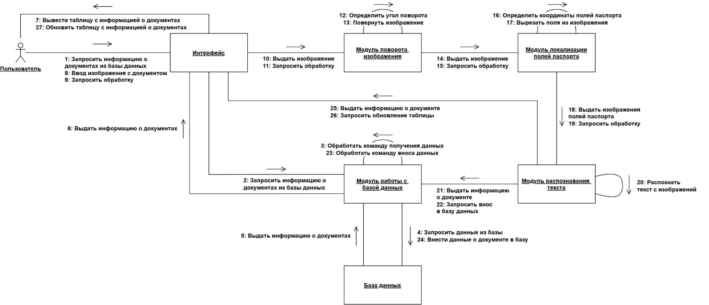
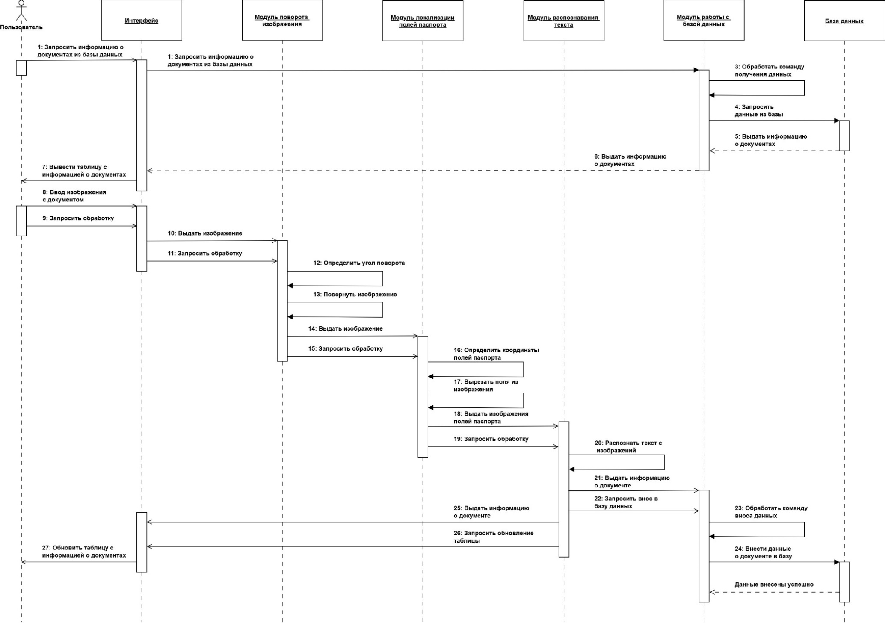
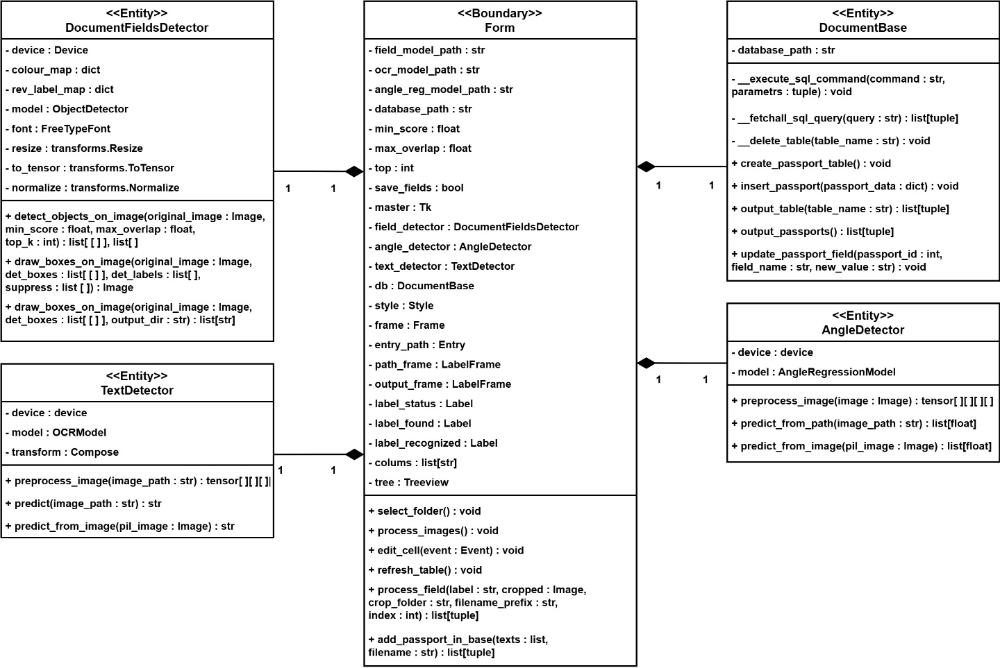
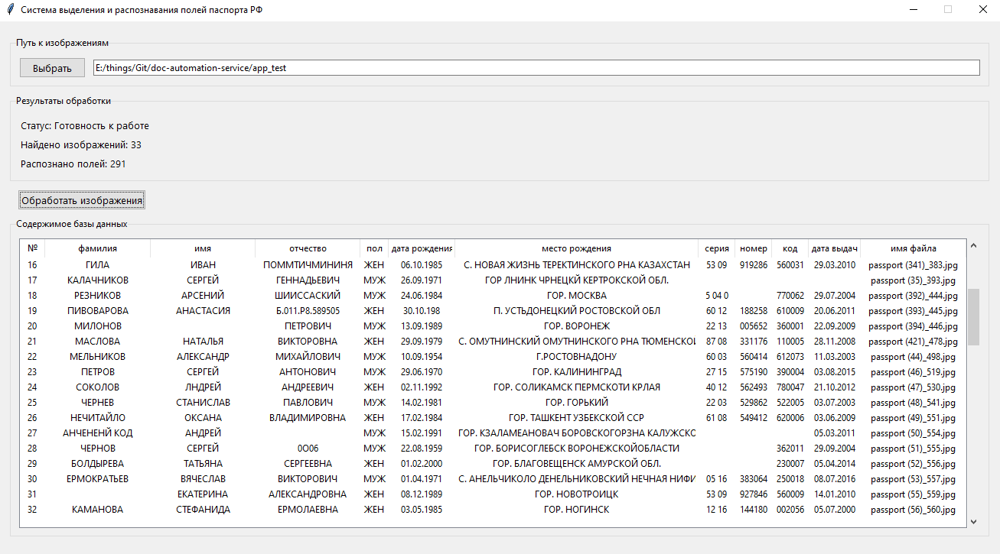

# Document Automation Service

Сервис для автоматизации работы с документами.  
Распознаёт отдельные поля документов на изображениях и сохраняет данные в защищённую базу.

Document Automation Service for HR documents.  
Recognizes individual fields on document images and securely stores data in a database.

## Contents
- [Features](#features--возможности)
- [Project structure](#структура-проекта--project-structure)
- [Installation](#installation--установка)
- [Usage](#usage--использование)
- [Technologies](#technologies--технологии)
- [Full documentation](#full-documentation--расширенная-документация)
- [License](#license)

## Features / Возможности

### Русский
- Средняя точность распознавания 93%
- Распознавание отдельных полей документов
- Коррекция угла поворота документа на изображении
- Реализован механизм защиты данных
- Работа с базой данных

### English
- Average recognition accuracy: 93%
- Recognition of individual document fields
- Document rotation correction
- Data protection mechanism
- Automatic database entry
- Processing 5x faster than manual input

## Структура проекта / Project structure
Датасеты для обучения моделей приватные и не выкладываются в публичный доступ.

Datasets for model training are private and are not publicly available.

```
doc-automation-service/
├── data/                       # папка с датасетами для обучения моделей
│   ├── angle_dataset/          # датасет для обучения модели регрессии угла
│   ├── data_for_gen/           # данные для генерации ocr_dataset
│   ├── fields_dataset/         # датасет для обучения модели локализации полей
│   └── ocr_dataset/            # датасет для обучения модели распознавания текста
├── example/                    # примеры для тестирования сервиса
├── example_processed/          # результаты тестирования сервиса
├── images/                     # ресурсы изображений
├── models/                     # веса обученных моделей
├── src/                        # исходный код
│   ├── angle_regression/       # модуль модели регрессии угла поворота
│   ├── database/               # модуль работы с базой данных
│   ├── fields_detector/        # модуль модели локализации полей
│   ├── ocr/                    # модуль модели распознавания текста
│   ├── utils/                  # вспомогательные функции
│   ├── angle_train_eval.py     # обучение и тестирование модели регрессии угла поворота
│   ├── application.py          # исходный код приложения
│   ├── bb_data_preparer.py     # подготовка датасета локализации полей
│   ├── fields_det_eval.py      # обучение модели локализации полей
│   ├── fields_det_train.py     # тестирование модели локализации полей
│   └── ocr_train_eval.py       # обучение и тестирование модели распознавания текста
└── tests/                      # модульные тесты
```

## Installation / Установка

### Русский
1. Клонирование репозитория
2. Установка зависимостей
3. Установите PyTorch с поддержкой CUDA отдельно

### English
1. Clone the repository
2. Install dependencies
3. Install PyTorch with CUDA support separately

```bash
git clone https://github.com/tanatolog/doc-automation-service.git
cd doc-automation-service
pip install -r requirements.txt
pip install torch==2.5.1+cu121 torchvision --index-url https://download.pytorch.org/whl/cu121
```

## Usage

### Русский
1. Вставить ключ-флешку
2. На флешке должен быть файл db_key.txt с паролем к базе данных
3. Запустить application.py
4. При первом запуске будет создана новая база данных, к ней будет привязана ключ-флешка с паролем

### English
1. Insert the key USB drive
2. The drive must contain db_key.txt with the database password
3. Run application.py
4. On first run, a new database will be created and linked to the key USB

```bash
python src/application.py
```

## Technologies / Технологии
- Python
- PyTorch
- SQLCipher3
- CUDA

## Full documentation / Расширенная документация

### Русский
Сервис состоит из 5 модулей:
1. Интерфейс
2. Поворот изображения: сверточная сеть для определения угла документа
3. Локализация полей: ИНС-детектор объектов
4. Распознавание текста: модель кодер-декодер с вниманием
5. Модуль работы с базой данных

Все разработанные нейросетевые модели были обучены на датасетах, также разработанных мной.

Для более полного понимания структуры сервиса в папке `images` представлены диаграммы классов.

### English
The service consists of 5 modules:
1. Interface
2. Image rotation: CNN for document angle detection
3. Field localization: neural network object detector
4. Text recognition: encoder-decoder model with attention
5. Database module

All neural network models were trained on datasets that I had developed myself.

Class diagrams are available in the `images` folder for a full overview.









## License
This project is licensed under the MIT License – see the LICENSE file for details.